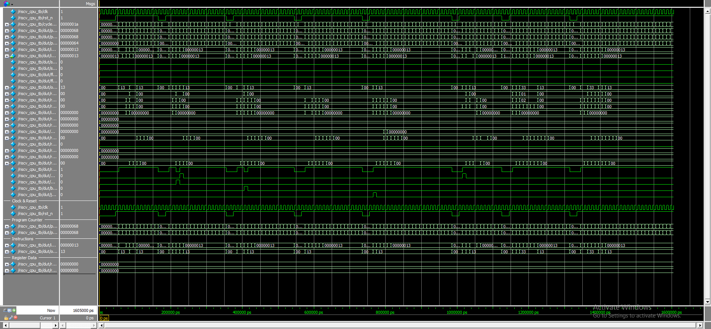

# RISC-V Processor Implementation

A complete 5-stage pipelined RISC-V processor implementation in SystemVerilog, supporting the RV32I instruction set. The design includes comprehensive verification testbenches and is ready for FPGA synthesis using Intel Quartus Prime 18.1.

## Project Overview

This project implements a fully functional RISC-V processor with the following features:

- **5-stage pipeline**: IF (Instruction Fetch) -> ID (Instruction Decode) -> EX (Execute) -> MEM (Memory) -> WB (Write Back)
- **RV32I instruction set**: Complete support for all base integer instructions
- **Hazard handling**: Data forwarding and hazard detection units
- **Memory interface**: Separate instruction and data memory interfaces
- **Professional HDL practices**: Centralized constants package and modular design

## File Organization

```
RISC-V/
├── riscv_pkg.sv              # Central constants package
├── riscv_cpu.sv              # Top-level CPU module
├── alu.sv                    # Arithmetic Logic Unit
├── control_unit.sv           # Control signal generation
├── data_memory.sv            # Data memory interface
├── forwarding_unit.sv        # Data forwarding logic
├── hazard_detection_unit.sv  # Pipeline hazard detection
├── imm_gen.sv                # Immediate value generator
├── instr_memory.sv           # Instruction memory interface
├── reg_file.sv               # 32-register register file
├── timing_constraints.sdc    # Timing constraints for synthesis
├── testbenches/              # Verification testbenches
│   ├── alu_tb.sv
│   ├── control_unit_tb.sv
│   ├── data_memory_tb.sv
│   ├── forwarding_unit_tb.sv
│   ├── hazard_detection_unit_tb.sv
│   ├── imm_gen_tb.sv
│   ├── instr_memory_tb.sv
│   ├── reg_file_tb.sv
│   └── riscv_cpu_tb.sv      # Full processor testbench
├── waveforms/                # Simulation waveform outputs
│   └── riscv_cpu_output.png  # Complete CPU simulation waveform
├── work/                     # ModelSim compilation directory
├── .gitignore
└── README.md
```

## Prerequisites

- **Intel Quartus Prime 18.1** or later
- **ModelSim** (included with Quartus) for simulation
- **Windows/Linux** operating system

## Running Testbenches in ModelSim

### Method 1: Command Line Simulation

Open PowerShell/Command Prompt in the project directory:

```bash
# Create work library first (if it doesn't exist)
vlib work

# Compile and run individual testbenches
vlog riscv_pkg.sv testbenches/alu_tb.sv alu.sv
vsim -c -do "run -all; quit" alu_tb

vlog riscv_pkg.sv testbenches/control_unit_tb.sv control_unit.sv
vsim -c -do "run -all; quit" control_unit_tb
  
vlog riscv_pkg.sv testbenches/data_memory_tb.sv data_memory.sv
vsim -c -do "run -all; quit" data_memory_tb

vlog riscv_pkg.sv testbenches/forwarding_unit_tb.sv forwarding_unit.sv
vsim -c -do "run -all; quit" forwarding_unit_tb

vlog riscv_pkg.sv testbenches/hazard_detection_unit_tb.sv hazard_detection_unit.sv
vsim -c -do "run -all; quit" hazard_detection_unit_tb

vlog riscv_pkg.sv testbenches/imm_gen_tb.sv imm_gen.sv
vsim -c -do "run -all; quit" imm_gen_tb

vlog riscv_pkg.sv testbenches/instr_memory_tb.sv instr_memory.sv
vsim -c -do "run -all; quit" instr_memory_tb

vlog riscv_pkg.sv testbenches/reg_file_tb.sv reg_file.sv
vsim -c -do "run -all; quit" reg_file_tb

# Full CPU testbench
vlog riscv_pkg.sv testbenches/riscv_cpu_tb.sv riscv_cpu.sv alu.sv control_unit.sv data_memory.sv forwarding_unit.sv hazard_detection_unit.sv imm_gen.sv instr_memory.sv reg_file.sv
vsim -c -do "run -all; quit" riscv_cpu_tb
```

### Method 2: GUI Simulation with Waveforms

1. **Launch ModelSim GUI:**
   ```bash
   vsim -gui
   ```

2. **Compile design files:**
   ```tcl
   # In ModelSim transcript window
   vlib work
   vlog riscv_pkg.sv testbenches/alu_tb.sv alu.sv
   ```

3. **Load testbench:**
   ```tcl
   vsim work.alu_tb
   ```

4. **Add signals to waveform:**
   ```tcl
   # Essential signals
   add wave -radix hex /alu_tb/clk
   add wave -radix hex /alu_tb/a
   add wave -radix hex /alu_tb/b
   add wave -radix hex /alu_tb/result
   add wave /alu_tb/alu_ctrl
   ```

5. **Run simulation:**
   ```tcl
   run -all
   wave zoomfull
   ```

## Simulation Results

### Expected Test Results

All testbenches should pass with these results:

- **ALU Testbench**: 37/37 tests passed
- **Control Unit Testbench**: 34/34 tests passed
- **Data Memory Testbench**: 30/30 tests passed
- **Forwarding Unit Testbench**: All tests passed
- **Hazard Detection Testbench**: 20/20 tests passed
- **Immediate Generator Testbench**: All tests passed
- **Instruction Memory Testbench**: 23/23 tests passed
- **Register File Testbench**: 24/24 tests passed
- **Full CPU Testbench**: 28/28 tests passed

### RISC-V CPU Waveform

The complete processor simulation produces comprehensive waveforms showing pipeline operation:



The waveform demonstrates:
- **Pipeline stages**: Clear progression through IF, ID, EX, MEM, WB stages
- **Instruction execution**: Sequential processing of different instruction types
- **Program counter**: Proper PC increment and branch/jump behavior
- **Pipeline control**: Hazard detection and data forwarding in action
- **Memory operations**: Load/store instruction execution
- **Register file access**: Read/write operations with proper timing

## Instruction Set Support

Complete RV32I base instruction set:
- **R-type**: ADD, SUB, SLL, SLT, SLTU, XOR, SRL, SRA, OR, AND
- **I-type**: ADDI, SLTI, SLTIU, XORI, ORI, ANDI, SLLI, SRLI, SRAI, LW
- **S-type**: SW
- **B-type**: BEQ, BNE, BLT, BGE, BLTU, BGEU
- **U-type**: LUI, AUIPC
- **J-type**: JAL, JALR

## Architecture Features

- **5-stage pipeline** with proper hazard handling
- **Data forwarding** from EX/MEM and MEM/WB stages
- **Load-use hazard detection** with pipeline stalls
- **Branch prediction** (not taken, with flush on misprediction)
- **32-register register file** with x0 hardwired to zero
- **Harvard architecture** with separate instruction/data memories